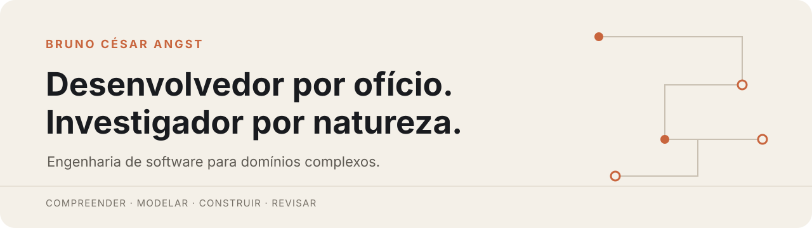

<picture>
  <source media="(prefers-color-scheme: dark)" srcset="./assets/capa-escura.svg">
  <source media="(prefers-color-scheme: light)" srcset="./assets/capa-clara.svg">
  
</picture>

  
  

> Transformo regras de negócio, estados de interação e integrações difíceis em sistemas claros, verificáveis e preparados para evoluir.

## Meu trabalho

Atuo na interseção entre **produto, domínio e engenharia de software**. Minha contribuição começa antes da implementação: investigo o problema, separo fatos de hipóteses, torno decisões explícitas e construo contratos que conectam interface, API, dados e operação.

Tenho maior impacto quando o software começa a resistir: regras extensas, estados difíceis de prever, compatibilidade legada, múltiplos repositórios, decisões arquiteturais dispersas ou automações que precisam operar com segurança.

Não procuro apenas fazer uma funcionalidade funcionar. Procuro compreender **por que funciona, onde pode falhar e como continuará evoluindo**.

## Agora — julho de 2026

- projetando modelos de interação para editores visuais e estruturas recursivas;
- desenvolvendo automações seguras para revisão e manutenção de código;
- aprofundando governança técnica com contratos, ADRs e evidências verificáveis;
- experimentando a integração entre software, dispositivos compactos e processamento local;
- publicando notas sobre arquitetura, ferramentas e pensamento crítico aplicado à engenharia.

## Engenharia publicada

| Material | O que demonstra |
| --- | --- |
| [Editor visual de regras](https://github.com/BrunoCesarAngst/digitalGarden/blob/main/case-studies/editor-visual-de-regras.md) | Modelagem de domínio, AST, interação, contratos e evolução incremental |
| [Automação segura de revisão](https://github.com/BrunoCesarAngst/digitalGarden/blob/main/case-studies/automacao-segura-de-revisao.md) | Governança, Git, isolamento por worktree e segurança operacional |
| [Seleção não é foco](https://github.com/BrunoCesarAngst/digitalGarden/blob/main/notes/selecao-nao-e-foco.md) | Arquitetura front-end, máquinas de estado e acessibilidade |
| [Decisões que sobrevivem ao código](https://github.com/BrunoCesarAngst/digitalGarden/blob/main/notes/decisoes-arquiteturais.md) | ADRs, rastreabilidade e alinhamento entre contrato, implementação e teste |
| [Polyrepos e worktrees](https://github.com/BrunoCesarAngst/digitalGarden/blob/main/notes/polyrepos-e-worktrees.md) | Organização de ambientes complexos sem contaminar os produtos |

## Projetos públicos selecionados

| Projeto | Papel na minha trajetória |
| --- | --- |
| [brunoangst.com.br](https://github.com/BrunoCesarAngst/brunoangst.com.br) | Presença profissional, escrita e identidade digital |
| [digitalGarden](https://github.com/BrunoCesarAngst/digitalGarden) | Conhecimento técnico público e estudos de engenharia |
| [appadosal](https://github.com/BrunoCesarAngst/appadosal) | Aplicação full-stack TypeScript com tRPC, Drizzle, autenticação e PWA |
| [agenda-arroio](https://github.com/BrunoCesarAngst/agenda-arroio) | Aplicação Vue 3 para agendamento, administração e operação local |
| [demando](https://github.com/BrunoCesarAngst/demando) | Gestão de demandas com Django, API REST, HTMX e documentação interativa |
| [app-mysys](https://github.com/BrunoCesarAngst/app-mysys) | Modelagem de um sistema pessoal inspirado em GTD, ZTD e PARA |

## Ferramentas que uso

`Vue 3` · `TypeScript` · `Vite` · `Pinia` · `Vitest` · `Java 21` · `Quarkus` · `REST` · `PostgreSQL` · `Flyway` · `Redis` · `Docker` · `Linux` · `Git`

## Princípios

- **Compreender antes de construir.** Complexidade mal compreendida reaparece como retrabalho.
- **Tornar decisões verificáveis.** Documentação, contratos, código e testes precisam contar a mesma história.
- **Evoluir sem apagar o contexto.** Compatibilidade e rastreabilidade preservam a capacidade de decidir.
- **Automatizar sem perder controle.** Uma boa automação conhece seus limites e mantém decisões críticas sob responsabilidade humana.

## Contato

Meu site reúne apresentação, princípios, textos e formas de contato:

### [brunoangst.com.br](https://brunoangst.com.br/)

  <strong>Código é parte da solução. O restante está nas decisões que o tornaram possível.</strong>

